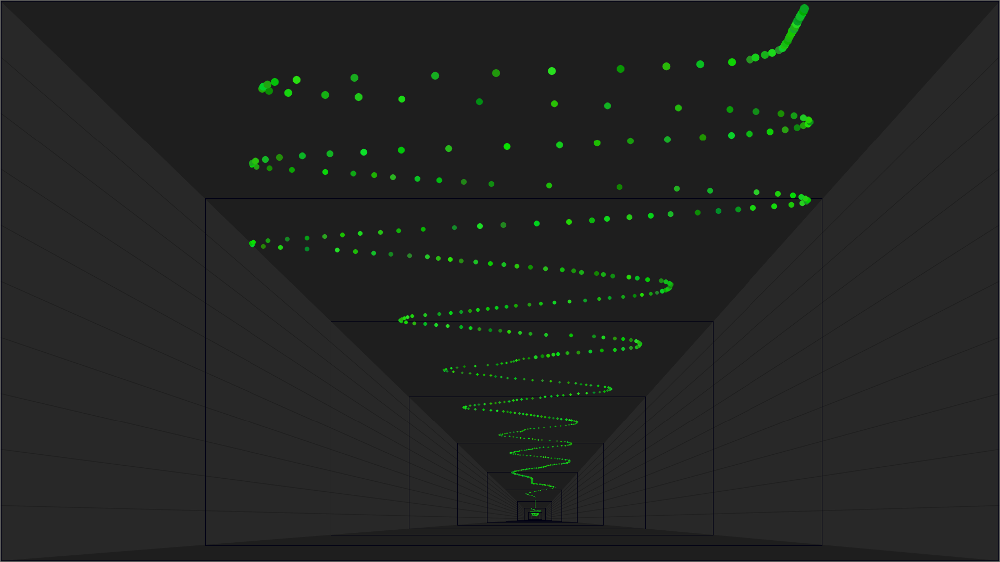
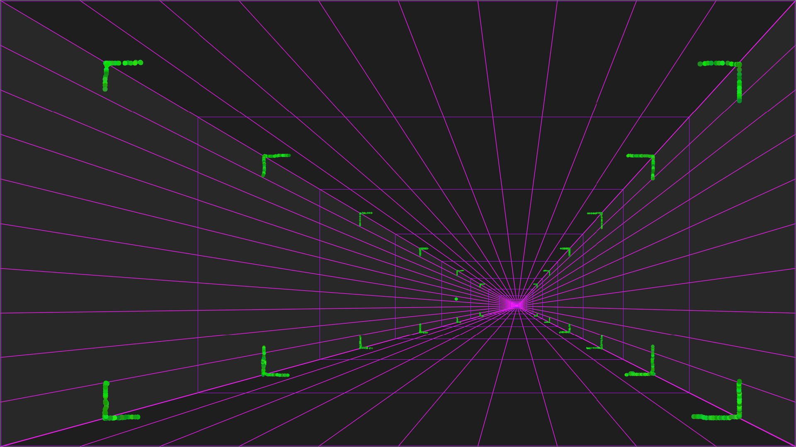
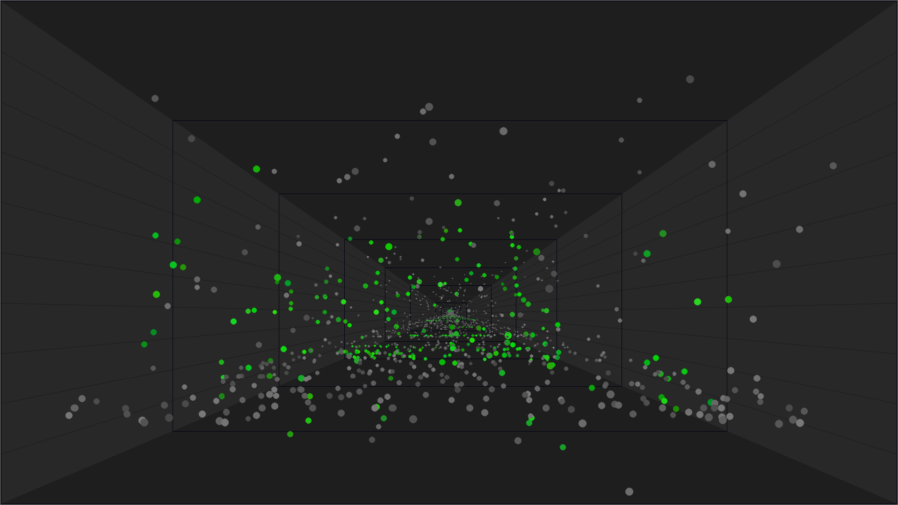

interactive_grid
===========
.. image:: grid_views/interactive_grid.gif

Info
===========
Interactive 3D grid, written in python opencv. Control it with mouse and keyboard. Put points on it, freeze them, change perspective, colors, hide and show items. Use pseudo gravity and antigravity. Am I missed something? Oh yeah - feel free to modify it for your needs :)

Install
===========

1. Copy repo (or at least .py files & requirements.txt) to your local device:
::
    git clone https://github.com/streanger/interactive_grid.git
2. Install dependencies (numpy, opencv) with command:
::
    pip install -r requirements.txt
    
3. Run script and follow terminal usage content:
::
    python interactive_grid.py

Usage
===========
mouse actions:
::
    left-mouse-button-press               - draw bullets
    mouse-center-hold-with-mouse-moves    - move grid center

keyboard actions:
::
    g     - hide/show grid
    f     - freeze points & bullets
    c     - remove all visible pieces
    p     - hide/show points
    b     - hide/show bullets
    d     - gravity down
    u     - gravity up
    v     - variable/fixed bullets speed
    w     - hide/show walls
    s     - switch light square modes
    x     - squares speed up
    +     - increase squares depth
    -     - decrease squares depth
    0-9   - color mode
    q     - quit from grid

Example views
===========

